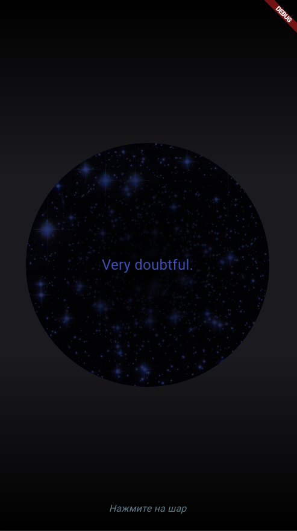

# Целевая платформа

Web, Linux.

# Результаты

Реализована только базовая функциональность. Интересно было попробовать sealed-классы. Можно нигде не учитывать результат.

# Ссылки на демонстрацию работы/скриншоты

Скриншоты приложения:

